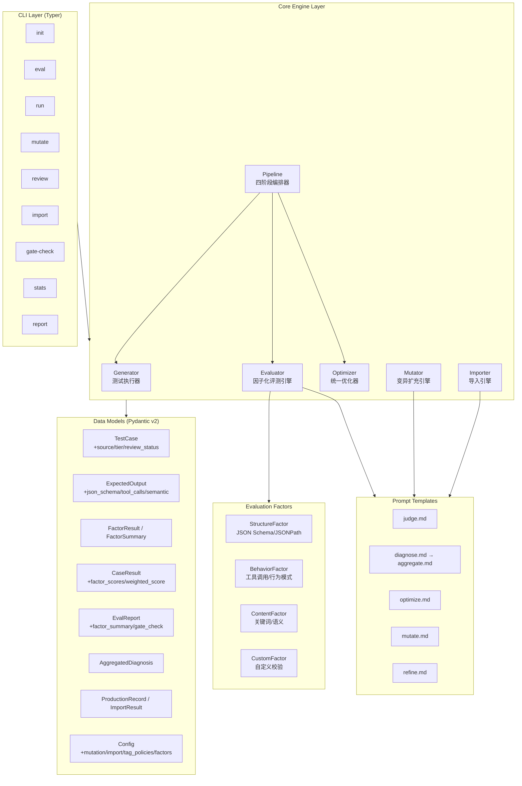
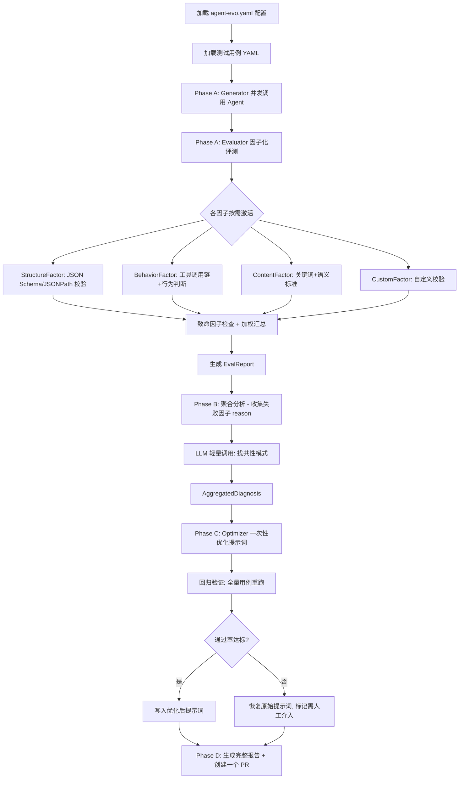
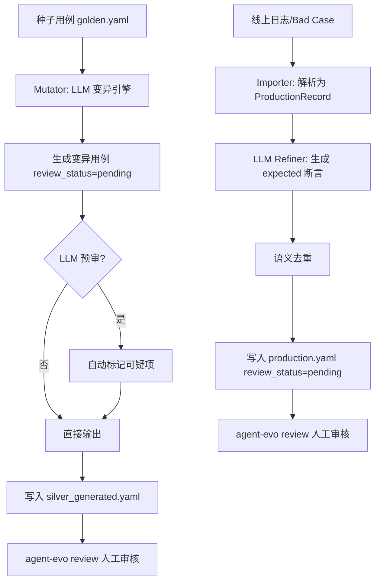

## Product Overview

AgentEvo 是一个 LLM Agent 自动化评测与优化框架。当前具备手工编写测试用例、基础 Pipeline（Generator - Evaluator - Optimizer）、LLM-as-Judge 评判 + 诊断归因 + 自动优化提示词等能力。本次增强将在四个阶段补齐四项核心缺失能力，使框架支持完整的测评集生命周期管理。

## Core Features

### 1. 数据模型与分类体系扩展（Phase 1）

- 扩展 TestCase 模型，新增来源（manual/mutation/production）、父级关联、变异策略、审核状态、层级（gold/silver）、错误输出等字段
- 扩展 ExpectedOutput 模型，按因子维度新增 JSON Schema 校验、JSONPath 断言、工具调用断言、语义标准等结构化断言字段
- 新增因子评分结果模型（FactorResult、FactorSummary）、聚合归因模型（AggregatedDiagnosis）、导入记录模型（ProductionRecord、ImportResult）
- 扩展配置体系，新增 tag_policies（任意 tag 独立评测策略）、factors（因子权重配置）、mutation、import 配置节
- 重构 CaseResult，以因子评分明细 + 加权总分替代旧的维度评分
- 扩展 EvalReport，新增因子汇总、按 tag/tier 分组统计、门禁阻断判断
- 实现 dimensions 向 factors 的向后兼容自动映射，旧模型标记 deprecated

### 2. 因子化评测引擎与批量流程（Phase 2）

- 实现 EvaluationFactor 抽象基类及 4 个内置因子：structure（结构正确性）、behavior（行为正确性）、content（内容质量）、custom（自定义校验）
- 因子按需激活：根据 ExpectedOutput 中定义的字段自动判断哪些因子参与评分
- 致命因子机制：fatal 因子不通过则整条用例直接判定失败
- 加权汇总评分：激活因子按权重计算加权总分
- 重构 Pipeline 为四阶段批量流程：Phase A（批量执行+评测+即时归因）- Phase B（聚合分析找共性模式）- Phase C（统一优化+回归验证）- Phase D（生成报告+一个 PR）
- 基于 tag_policies 实现差异化评测策略和门禁检查
- 新增 gate-check 和 stats CLI 命令

### 3. 变异扩充引擎（Phase 3）

- 实现 Mutator 变异引擎，基于黄金测评集种子用例，利用 LLM 进行 Evol-Instruct 式变异扩充
- LLM 自由发挥为主，参考方向（hint_directions）为辅，支持用户自定义变异方向
- LLM 预审机制：自动检查变异用例的逻辑合理性
- 生成的变异用例写入独立 YAML 文件（白银集），不污染原始黄金集
- 新增 mutate 和 review CLI 命令
- 实现 TestCase Model 到 YAML 的序列化写入

### 4. 线上数据导入（Phase 4）

- 实现 TestCaseImporter 导入引擎，支持从 JSONL、CSV、YAML、Raw Conversation 格式导入线上 Bad Case 数据
- LLM 提炼引擎（Refiner）：分析错误输出，自动生成正确的 expected 断言、推断断言类型、自动打标签
- 语义去重：基于相似度避免重复用例入库
- 导入数据默认标记为 pending 审核状态，保留 bad_output 字段供归因参考
- 新增 import CLI 命令

## Tech Stack

- **语言**: Python 3.10+
- **数据模型**: Pydantic v2
- **CLI 框架**: Typer + Rich
- **LLM 调用**: OpenAI (AsyncOpenAI)
- **配置/序列化**: PyYAML
- **Git 集成**: GitPython
- **HTTP 客户端**: httpx
- **测试**: pytest + pytest-asyncio
- **Lint**: ruff
- **包管理**: Poetry

## Tech Architecture

### System Architecture



### Module Division

#### 1. Models 模块 (`models/`)

- **职责**: 所有数据结构定义，Pydantic v2 模型
- **变更文件**:
- `models/test_case.py`: 扩展 TestCase、ExpectedOutput，新增 TestCaseTier/TestCaseSource/ReviewStatus 枚举，新增 JsonPathAssertion/ToolCallAssertion/ToolCallConstraints
- `models/eval_result.py`: 重构 CaseResult（factor_scores 替代 dimension_scores），扩展 TagStats/EvalReport，新增 FactorResult/FactorSummary
- `models/diagnosis.py`: 新增 AggregatedDiagnosis，标记旧 DiagnosisCategory/DiagnosisResult 为 deprecated
- `models/config.py`: 新增 FactorConfig/TagPolicyConfig/MutationConfig/ImportConfig，重构 JudgeConfig（dimensions->factors 兼容），扩展 Config
- `models/import_models.py`（新增）: ProductionRecord/ImportResult
- `models/__init__.py`: 更新导出

#### 2. Core 模块 (`core/`)

- **变更文件**:
- `core/evaluator.py`: 重构为因子化评测引擎，注册 4 个因子，实现 evaluate_case（因子激活+独立评分+加权汇总）和 evaluate_all
- `core/factors.py`（新增）: EvaluationFactor 基类 + StructureFactor/BehaviorFactor/ContentFactor/CustomFactor 实现
- `core/pipeline.py`: 重构为 Phase A-B-C-D 四阶段批量流程
- `core/optimizer.py`: 适配聚合归因输入（AggregatedDiagnosis），一次性优化
- `core/mutator.py`（新增）: 变异扩充引擎
- `core/importer.py`（新增）: 导入引擎
- `core/serializer.py`（新增）: TestCase Model -> YAML 序列化
- `core/config.py`: 适配新配置模型，增加 dimensions->factors 向后兼容映射

#### 3. CLI 模块 (`cli/`)

- **变更文件**:
- `cli/main.py`: 注册 mutate/review/import/gate-check/stats 新命令，eval 命令增加 --tier 参数
- `cli/commands/mutate.py`（新增）: 变异扩充命令
- `cli/commands/review.py`（新增）: 审核命令
- `cli/commands/import_cmd.py`（新增）: 导入命令
- `cli/commands/gate_check.py`（新增）: 门禁检查命令
- `cli/commands/stats.py`（新增）: 统计命令
- `cli/commands/eval.py`: 适配因子化评测报告输出
- `cli/commands/run.py`: 适配新 Pipeline 流程
- `cli/commands/report.py`: 适配新报告结构（因子维度、tag策略达标）

#### 4. Prompts 模块 (`prompts/`)

- **变更文件**:
- `prompts/judge.md`: 重构为因子化评判提示词（按因子维度评分）
- `prompts/mutate.md`（新增）: 变异生成提示词
- `prompts/refine.md`（新增）: 线上数据提炼提示词
- `prompts/aggregate.md`（新增）: 聚合归因分析提示词

### Data Flow





## Implementation Details

### Core Directory Structure

```
src/agent_evo/
├── models/
│   ├── config.py             # 修改: +FactorConfig, TagPolicyConfig, MutationConfig, ImportConfig
│   ├── test_case.py          # 修改: +TestCaseTier, TestCaseSource, ReviewStatus, JsonPathAssertion, ToolCallAssertion, ToolCallConstraints, ExpectedOutput扩展
│   ├── eval_result.py        # 修改: +FactorResult, FactorSummary, AggregatedDiagnosis, CaseResult重构, EvalReport扩展
│   ├── diagnosis.py          # 修改: DiagnosisCategory/DiagnosisResult 标记deprecated, +AggregatedDiagnosis
│   ├── import_models.py      # 新增: ProductionRecord, ImportResult
│   └── __init__.py           # 修改: 更新导出列表
├── core/
│   ├── config.py             # 修改: dimensions->factors 向后兼容映射
│   ├── factors.py            # 新增: EvaluationFactor基类 + 4个因子实现
│   ├── evaluator.py          # 重构: 因子化评测引擎
│   ├── pipeline.py           # 重构: Phase A-B-C-D 四阶段流程
│   ├── optimizer.py          # 修改: 适配AggregatedDiagnosis输入
│   ├── mutator.py            # 新增: 变异扩充引擎
│   ├── importer.py           # 新增: 导入引擎
│   ├── serializer.py         # 新增: TestCase -> YAML 序列化
│   └── generator.py          # 修改: load_test_cases 支持 tier 过滤
├── cli/
│   ├── main.py               # 修改: 注册新命令
│   └── commands/
│       ├── eval.py           # 修改: 适配因子化报告
│       ├── run.py            # 修改: 适配新Pipeline
│       ├── report.py         # 修改: 适配新报告结构
│       ├── mutate.py         # 新增: mutate命令
│       ├── review.py         # 新增: review命令
│       ├── import_cmd.py     # 新增: import命令
│       ├── gate_check.py     # 新增: gate-check命令
│       └── stats.py          # 新增: stats命令
└── prompts/
    ├── judge.md              # 修改: 因子化评判提示词
    ├── aggregate.md          # 新增: 聚合归因提示词
    ├── mutate.md             # 新增: 变异生成提示词
    └── refine.md             # 新增: 线上数据提炼提示词
```

### Key Code Structures

**TestCase 扩展字段**: 新增来源追踪、层级管理、审核状态等字段，所有新字段均有默认值确保向后兼容。

```python
class TestCaseTier(str, Enum):
    GOLD = "gold"
    SILVER = "silver"

class TestCaseSource(str, Enum):
    MANUAL = "manual"
    MUTATION = "mutation"
    PRODUCTION = "production"

class ReviewStatus(str, Enum):
    PENDING = "pending"
    APPROVED = "approved"
    REJECTED = "rejected"

class TestCase(BaseModel):
    # ... 现有字段保留 ...
    source: TestCaseSource = Field(default=TestCaseSource.MANUAL)
    parent_id: Optional[str] = Field(default=None)
    mutation_strategy: Optional[str] = Field(default=None)
    review_status: ReviewStatus = Field(default=ReviewStatus.APPROVED)
    tier: TestCaseTier = Field(default=TestCaseTier.GOLD)
    bad_output: Optional[str] = Field(default=None)
```

**EvaluationFactor 基类与因子注册**: 定义因子化评测的核心抽象，每个因子独立判断是否激活、独立评分。

```python
class EvaluationFactor(ABC):
    factor_id: str
    weight: float = 1.0
    fatal: bool = False

    @abstractmethod
    def is_triggered(self, expected: ExpectedOutput) -> bool:
        """根据 expected 字段判断是否激活本因子"""

    @abstractmethod
    async def evaluate(self, case: TestCase, output: str, llm: LLMClient) -> FactorResult:
        """执行评测，返回 0-1 分 + reason + details"""

class StructureFactor(EvaluationFactor):
    factor_id = "structure"
    def is_triggered(self, expected):
        return any([expected.json_schema, expected.schema_file,
                     expected.exact_json, expected.json_path_assertions])

class BehaviorFactor(EvaluationFactor):
    factor_id = "behavior"
    def is_triggered(self, expected):
        return any([expected.behavior, expected.required_tool_calls,
                     expected.tool_call_constraints])

class ContentFactor(EvaluationFactor):
    factor_id = "content"
    def is_triggered(self, expected):
        return any([expected.contains, expected.not_contains,
                     expected.semantic_criteria])

class CustomFactor(EvaluationFactor):
    factor_id = "custom"
    def is_triggered(self, expected):
        return expected.validator is not None
```

**Config 扩展与向后兼容**: JudgeConfig 支持 factors 新格式，自动将旧 dimensions 映射为 content 因子。

```python
class FactorConfig(BaseModel):
    weight: float = 1.0
    fatal: bool = False

class TagPolicyConfig(BaseModel):
    pass_threshold: float = 0.7
    fail_fast: bool = False
    required_for_release: bool = False
    description: str = ""

class MutationConfig(BaseModel):
    count_per_case: int = 3
    auto_review: bool = True
    business_docs: Optional[str] = None
    hint_directions: list[str] = Field(default_factory=list)

class ImportConfig(BaseModel):
    default_format: str = "jsonl"
    auto_refine: bool = True
    auto_deduplicate: bool = True
    default_tier: str = "silver"
    default_tags: list[str] = Field(default_factory=lambda: ["regression"])

class JudgeConfig(BaseModel):
    pass_threshold: float = 0.7
    factors: dict[str, FactorConfig] = Field(default_factory=lambda: {
        "structure": FactorConfig(weight=1.0, fatal=True),
        "behavior": FactorConfig(weight=0.8, fatal=False),
        "content": FactorConfig(weight=0.5, fatal=False),
        "custom": FactorConfig(weight=1.0, fatal=True),
    })
    # deprecated, 向后兼容
    dimensions: Optional[list[DimensionConfig]] = Field(default=None, deprecated=True)

class Config(BaseModel):
    # ... 现有字段 ...
    mutation: MutationConfig = Field(default_factory=MutationConfig)
    import_config: ImportConfig = Field(default_factory=ImportConfig, alias="import")
    tag_policies: dict[str, TagPolicyConfig] = Field(default_factory=dict)
```

### Technical Implementation Plan

#### Challenge 1: 因子化评测引擎

1. **问题**: 当前 Evaluator 硬编码为 LLM-as-Judge + dimensions 评分，无法适配不同类型 Agent
2. **方案**: 实现 EvaluationFactor 抽象基类，注册 4 个内置因子，按 expected 字段自动激活
3. **关键技术**: ABC 抽象类、jsonschema 库（structure 因子）、jsonpath-ng 库（JSONPath 断言）、确定性校验+LLM语义评判混合
4. **步骤**:

- 定义 EvaluationFactor 基类和 FactorResult 模型
- 实现 StructureFactor（JSON Schema 校验、精确匹配、JSONPath 断言，纯确定性）
- 实现 BehaviorFactor（工具调用链校验为确定性，行为判断用 LLM）
- 实现 ContentFactor（关键词匹配为确定性，semantic_criteria 用 LLM）
- 实现 CustomFactor（动态导入用户校验函数）
- 重构 Evaluator，注入因子列表，实现激活-评分-汇总流程

5. **测试**: 为每个因子编写单元测试，覆盖激活条件、评分逻辑、致命因子判定

#### Challenge 2: Pipeline 四阶段批量重构

1. **问题**: 当前 Pipeline 逐 case 诊断+逐 case 优化，产生碎片化修改
2. **方案**: 重构为 Phase A(批量执行+评测) -> Phase B(聚合分析) -> Phase C(统一优化+回归) -> Phase D(报告+PR)
3. **关键技术**: asyncio 并发、LLM 聚合分析（轻量调用，只传归因摘要）
4. **步骤**:

- Phase A: 复用现有 Generator.run_all + 新 Evaluator.evaluate_all
- Phase B: 实现 aggregate_diagnosis，收集失败用例的 factor reasons，用一次 LLM 调用找共性模式
- Phase C: 重构 Optimizer，接收 AggregatedDiagnosis，一次性优化提示词，全量回归验证
- Phase D: 生成完整报告（含因子维度统计、tag策略达标、归因摘要），创建一个 PR

#### Challenge 3: dimensions -> factors 向后兼容

1. **问题**: 现有用户配置和测试用例使用旧的 dimensions 格式
2. **方案**: 配置加载时检测 dimensions 字段，自动映射为 content 因子（因为旧的 correctness/completeness/format 本质上都是内容质量维度），打 warning 提示升级
3. **步骤**:

- config.py 的 load_config 中增加兼容逻辑
- JudgeConfig 使用 model_validator 做 dimensions->factors 转换
- 旧模型 DimensionScore 标记 deprecated，CaseResult 同时保留 dimension_scores（deprecated）和 factor_scores

### Integration Points

- **LLM 调用**: 所有 LLM 交互通过 `utils/llm.py` 的 `LLMClient` 统一封装，新增因子需要 LLM 的场景（behavior 判断、semantic_criteria、聚合分析、变异生成、数据提炼）均复用此客户端
- **YAML 序列化**: 新增 `core/serializer.py` 提供 TestCase Model -> YAML 写入能力，供 Mutator 和 Importer 使用
- **配置兼容**: `core/config.py` 的 `load_config` 增加 dimensions->factors 迁移逻辑

## Technical Considerations

### Performance Optimization

- 因子评测中确定性校验（JSON Schema、关键词匹配、JSONPath）不调用 LLM，零额外开销
- Phase B 聚合分析只传失败用例的因子 reason 摘要（不传原始输入输出），节省 token
- Generator 保留并发执行机制（asyncio.Semaphore）
- 变异和导入支持批量并发 LLM 调用

### Logging

- 复用现有 Rich console 输出模式
- 关键阶段（因子评分、聚合分析、变异生成）增加进度条和阶段性日志

### Security Measures

- 导入功能对外部数据（JSONL/CSV）做输入校验，防止注入
- CustomFactor 动态导入用户代码时做路径白名单校验

### Scalability

- 因子系统可扩展：用户可通过继承 EvaluationFactor 注册自定义因子
- tag_policies 支持任意 tag，不受预定义枚举限制
- 导入格式通过解析器模式可扩展新格式

### Dependencies

- 新增依赖: `jsonschema`（JSON Schema 校验）、`jsonpath-ng`（JSONPath 断言），需加入 pyproject.toml

## Agent Extensions

### Skill

- **agent-development-guide**
- Purpose: 在设计因子化评测引擎和变异策略时，参考 Agent 开发最佳实践，确保评测维度的设计符合行业规范
- Expected outcome: 因子设计（structure/behavior/content）的划分和权重策略符合 Anthropic/OpenAI 等厂商的 Agent 评测理念

### SubAgent

- **code-explorer**
- Purpose: 在实施各 Phase 时，用于跨文件搜索现有代码中的依赖关系、调用链路和导入路径，确保重构不遗漏关联文件
- Expected outcome: 准确识别所有需要修改的文件和受影响的代码路径，避免引入 break change